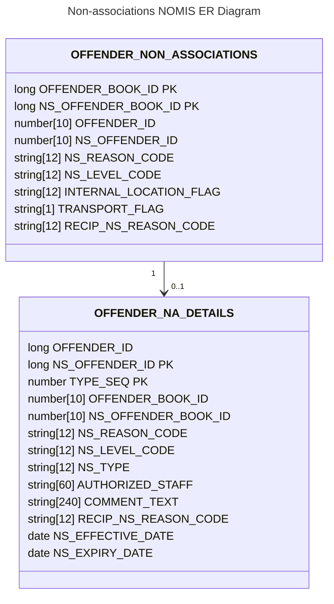
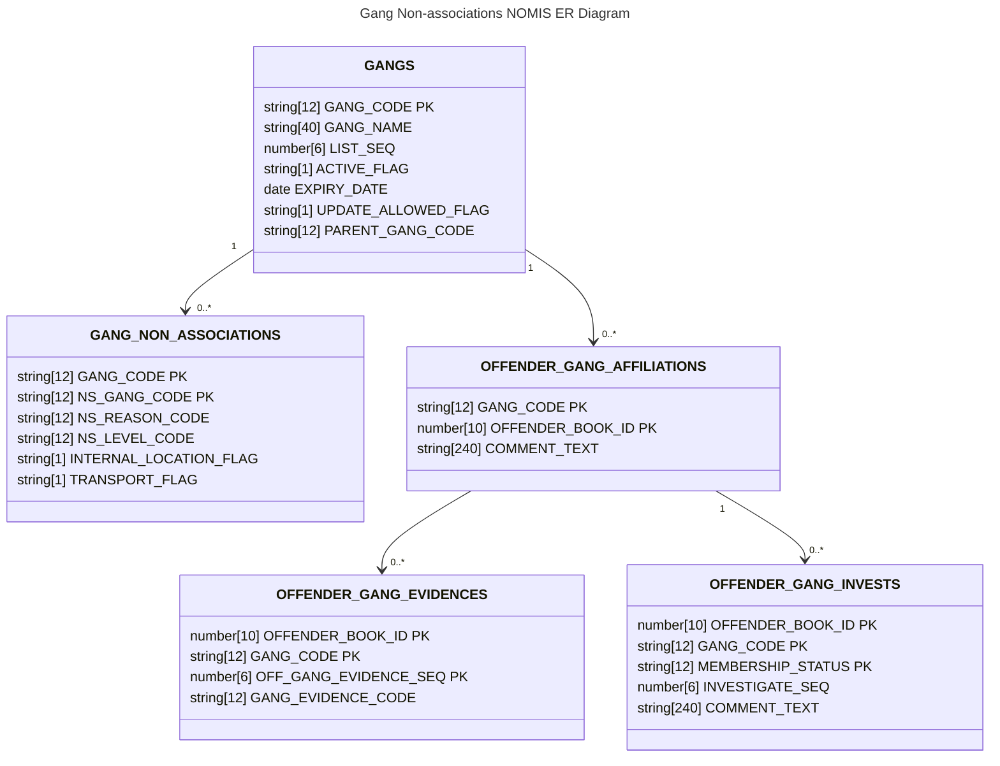

# 1. Existing NOMIS schema for non-associations

[Next >>](0003-migration-and-sync-with-NOMIS.md)

Date: 2023-06-13

## Status

Accepted

## Context
This illustrates the key fields that NOMIS holds on non-associations

### Gangs Schema

[Next >>](0003-migration-and-sync-with-NOMIS.md)
