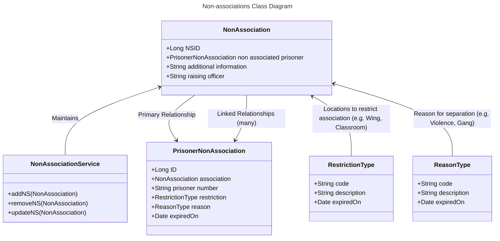

# 1. Non-associations Data Design

[Next >>](0004-migration-and-sync-with-NOMIS.md)


Date: 2023-06-13

## Status

Accepted

## Context

This document will cover the data structures needed to record non-association data in this service.

### Below show an initial class diagram of relationship between prisoners, and reference data



### Database tables

The `non_association` table forms the basis of one prisoner to potentially multiple non-associations - this allows for example to link multiple prisoners
one incident

```postgresql
 CREATE TABLE non_association
 (
   id                       uuid           NOT NULL PRIMARY KEY,
   prisoner_non_association uuid           NOT NULL,
   additional_information   text           NOT NULL,
   officer_username         varchar(30)    NOT NULL
 )
```

The `prisoner_non_association` represents an instance of a non-association and the reasons and separation requirements.
```postgresql
 CREATE TABLE prisoner_non_association
 (
   id                       uuid           NOT NULL PRIMARY KEY,
   non_association_id       uuid           NOT NULL,
   prisoner_number          varchar(7)     NOT NULL,    
   restriction_type_id      uuid           NOT NULL,
   reason_type_id           uuid           NOT NULL,
   expired_on               date
 )
```

```postgresql
CREATE TABLE restriction_type
(
    code                     uuid           NOT NULL PRIMARY KEY,
    description              varchar(200)   NOT NULL,
    expired_on               date
)
```

```postgresql
CREATE TABLE reason_type
(
    code                     uuid           NOT NULL PRIMARY KEY,
    description              varchar(200)   NOT NULL,
    expired_on               date
)
```

[Next >>](0004-migration-and-sync-with-NOMIS.md)
