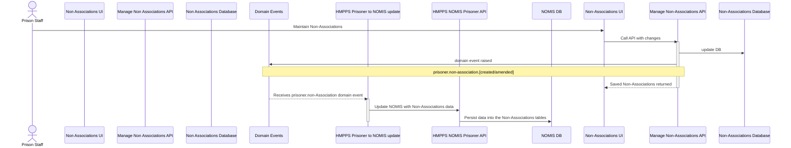
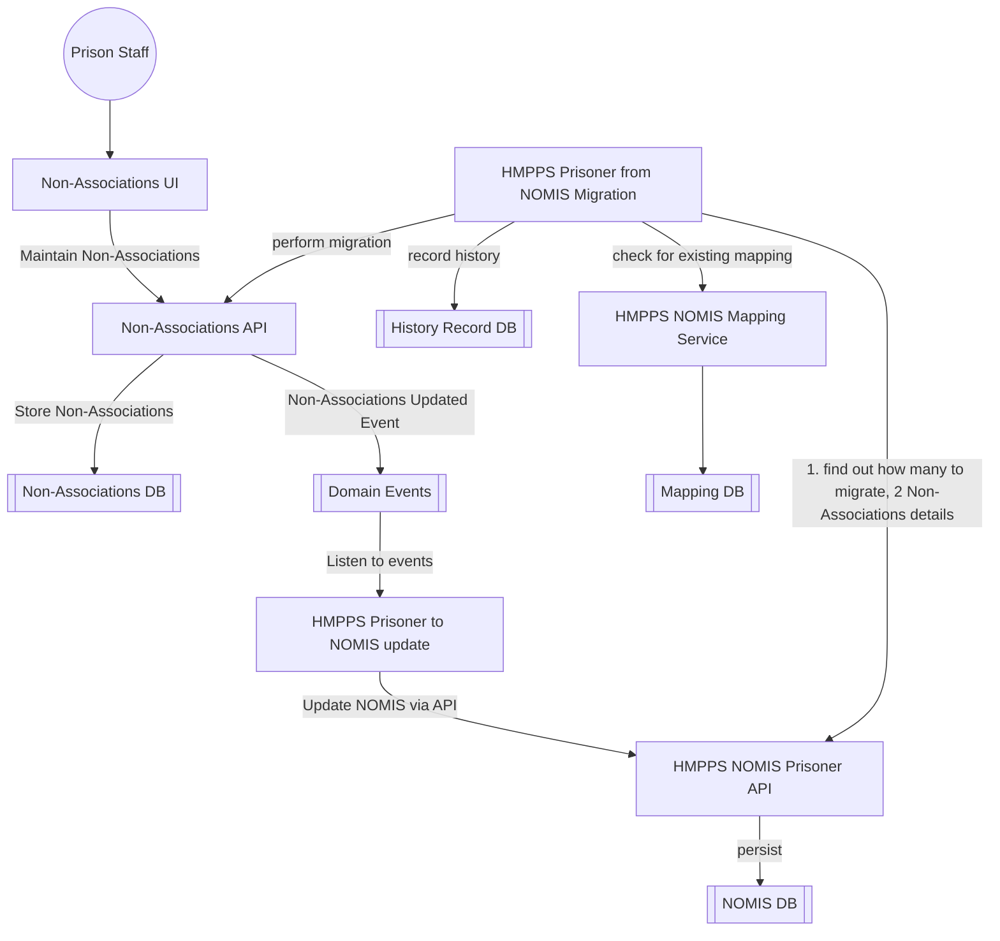

# 1. Mastering and Synchronisation of Non-associations data with NOMIS

[Next >>](0005-architecture.md)


Date: 2023-06-13

## Status

Accepted

## Context

This document will cover the approach for the non-associations service to "own" non-associations data and synchronisation this information back into NOMIS

### Migration plan for Non-Associations - Moving data off NOMIS approach
A two-way sync and migration pattern is to be adopted.

Therefore, the approach will be to :-
- Keep NOMIS up to date with changes made in Non-Associations service
- Provide a two-way sync and keep both systems in synchronisation so that turning off access to old NOMIS screens can be done prison by prison
- Migrate all the data from NOMIS
- Once all prisons had been switched over - turn off NOMIS -> DPS sync (now 1 way only)
- All access to screen removed

Steps taken:
The Non-Associations Team.
- Model the Non-Associations data in a new database 
- Build API functionality for managing the data 
- Provide Non-Associations endpoint in NS API that mirrors data in NOMIS
- Build screens to make use of the new API
- Raise events on creation or amendments of Non-Associationss
- Build a "sync" and "migrate" endpoints to allow NOMIS to send Non-Associations data

On NOMIS (syscon)
- Call Non-Associations "sync" endpoint when any updates where made to Non-Associations data in NOMIS
- Listen to events when Non-Associations where created in DPS and store them in NOMIS
- Migrate all the data held on Non-Associations in NOMIS by calling Non-Associations "migrate" endpoint
- Reconcile mismatches with weekly checks
- Remove all Non-Associations endpoints in prison-api once all services are using new Non-Associations API

Data is still held in NOMIS and will be maintained for reporting purposes.

### NOMIS synchronisation sequence
When a change is made to Non-Associations either a creation or update, events are be fired. The sequence of events for syncing back to NOMIS is shown below:



## Key components and their flow for Non-Associations sync



#### Domain Event Types:
In all instances the domain event will contain the unique reference to the Non-Associations.
- prisoner.non-associations.created 
- prisoner.non-associations.amended

**Example:**
```json
{
  "eventType": "prisoner.non-associations.amended",
  "occurredAt": "2023-03-14T10:00:00",
  "version": "1.0",
  "description": "Non-Associations added",
  "additionalInformation": {
    "prisonerNumber": "A1234AB"
  }
}
```


## API endpoints for sync

### Sync endpoint 
This endpoint will return all the Non-Associations information needed to populate NOMIS

`GET /non-associations/{prisonerNumber}`
```json
{
  "prisonerNumber": "A9109UD",
  "nonAssociations": [
    {
      "reasonCode": "VIC",
      "typeCode": "WING",
      "effectiveDate": "2021-07-05T10:35:17",
      "expiryDate": "2021-07-05T10:35:17",
      "authorisedBy": "Staff Name",
      "comments": "Do not location near",
      "prisonerNonAssociation": {
        "prisonerNumber": "A0135GA",
        "reasonCode": "PER"
      }
    }
  ]
}
```

### Sync endpoint
This endpoint will contain all the information need to populate the Non-Associations database with an Non-Associations related offender data changed in NOMIS

`POST /sync`
```json
{
  "prisonerNumber": "A9109UD",
  "nonAssociations": [
    {
      "reasonCode": "VIC",
      "typeCode": "WING",
      "effectiveDate": "2021-07-05T10:35:17",
      "expiryDate": "2021-07-05T10:35:17",
      "authorisedBy": "Staff Name",
      "comments": "Do not location near",
      "prisonerNonAssociation": {
        "prisonerNumber": "A0135GA",
        "reasonCode": "PER"
      }
    }
  ]
}
```

### Migration endpoint
This endpoint will contain all the information need to populate the Non-Associations database with an Non-Associations related offender data

`POST /migrate`
```json
{
  "prisonerNumber": "A9109UD",
  "nonAssociations": [
    {
      "reasonCode": "VIC",
      "typeCode": "WING",
      "effectiveDate": "2021-07-05T10:35:17",
      "expiryDate": "2021-07-05T10:35:17",
      "authorisedBy": "Staff Name",
      "comments": "Do not location near",
      "prisonerNonAssociation": {
        "prisonerNumber": "A0135GA",
        "reasonCode": "PER"
      }
    }
  ]
}
```


## Decision
- Migration process will be trialed in pre-prod and UAT testing will be needed to check mappings have accurately represented historical data
- NOMIS screens can be turned off once all non-associations screens are complete and staff are informed to switch over.


[Next >>](0005-architecture.md)
